# hw00

## owoHub 🚝 (web)

### Analysis
First, I only find a normal page that has its source code below.
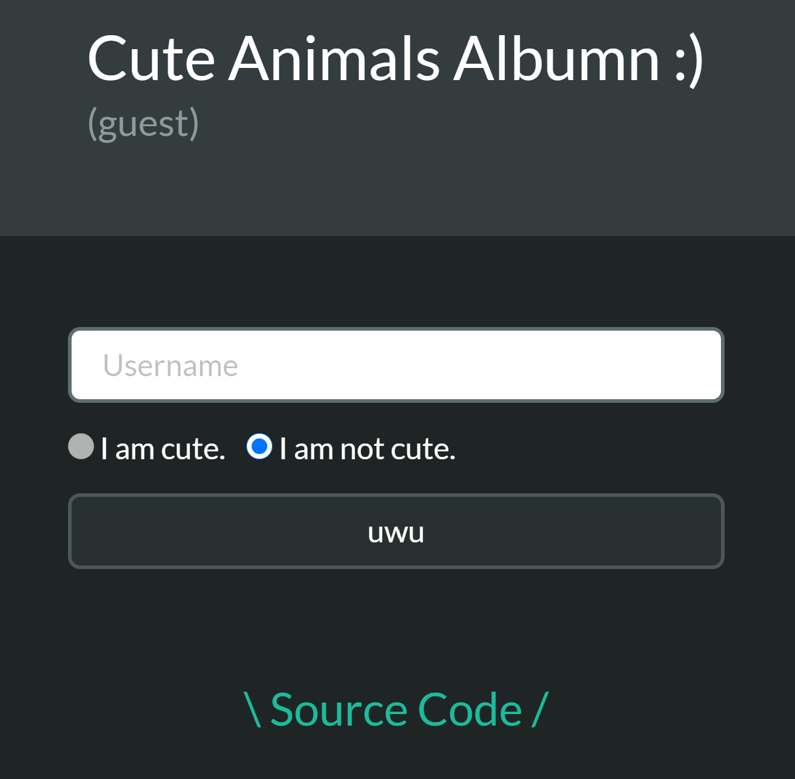

After going through this page, I find there is something interesting in source code:
`{"username":"${username}","admin":false,"cute":${cute}}`

About js **template literal**, we can use **\`${...}\`** (backticks) to inject expression or variable, and it can be regarded as pure string.
Let's create the payload!

### Attack
Our goal: `givemeflag === "yes" && userInfo.admin`
Data we can control: `username` and `cute`.
However, because `username` is limited in [a-z0-9], it seems useless and I can use it to bypass the rule.
And `cute` can be used to build payload because the rule only judges `cute` if ends with "true" or "false".

- Expected payload: `cute=true,"admin":true}%26givemeflag=yes%23false`
  - `true,"admin":true}...` to overwrite "admin" to true and enclose json right bracket.
  - `...%26givemeflag=yes...` to inject "givemeflag" with value "yes". %26 is "&" encoded.
  - `...%23false` to meet the rule. %23 is "#" encoded and it is used to get rid of redumdant chars (url hash).
- If username isn't limited in [a-z0-9]
`username=test","admin":true}%26givemeflag=yes%23false&cute=true`

## Cafe Overflow 🛹 (pwn)
1. Checksec shows `Stack: No canary found`
2. Inputing more than 24 chars will cause `segmentation fault`
=> Buffer overflow

### Solution 1
- Input arbitrary number of chars and set breakpoint at the end of main function
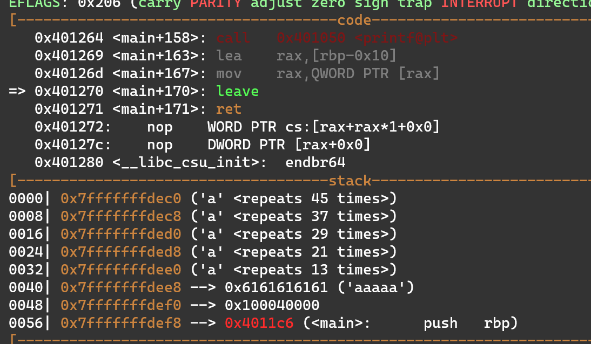
- Calculate the buffer size (45-21 = 24)
  - sol 2: pwntool cyclic and cyclic.find()
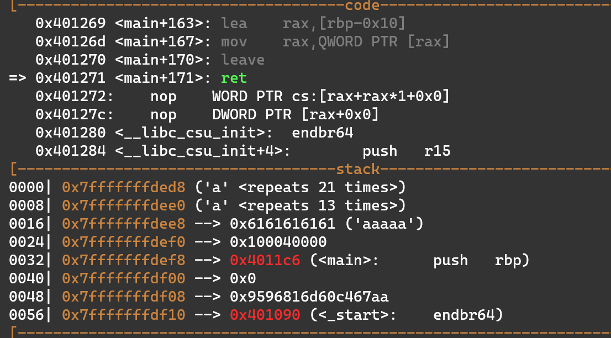

Payload is that sending 24 'a' and return address of the start of func1
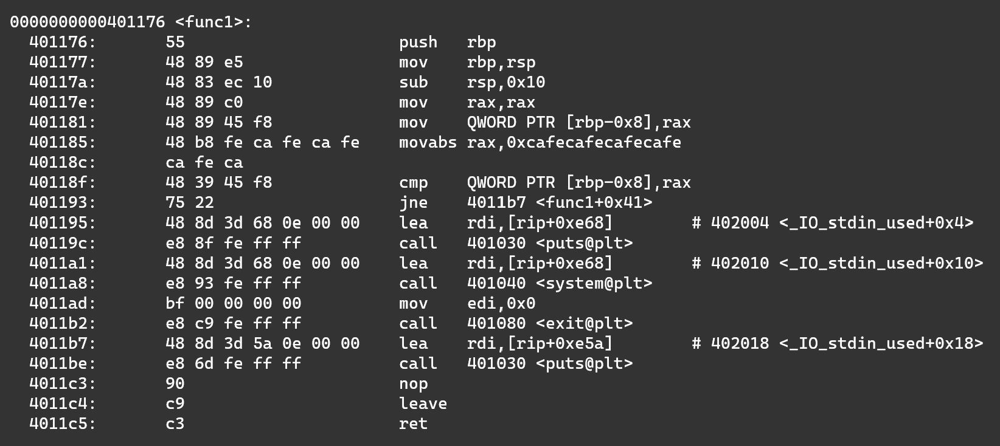

There will be a messages telling us it is almost done.
Then if we jump to `0x401195` which is below the func1, we can get the shell 😸

## The floating Aquamarine 💀 (misc)
Use **floating point error** to get money.

### Analysis
```
1. 1000000000: -8888000000(expect) => -8887999488(real) (diff 512)
2. -1000: -8887911120(expect) ==> -8887910400(real)  (diff 720)
3. -1000: -8887822240(expect) ==> -8887821312(real) (diff 928)
4. -99997000: 0(expect) ==> 1024(real) (diff 1024)
```

I find (8887999488 - 8887910400) == (8887910400 - 8887821312) == 89088, which (88.88*10000 == 88880) != 89088.
I don't know the accurate reason why I do 1~4 will make the balance crease $1024, but I think that those operations of floating point will cause **the "Exponent" bit creases one bit**.

### Attack
My payload:
1. 100000000
2. -1000
3. -1000
4. -90008000
5. goto 1.
Everytime you do 1~4, you will get $1024.
When you do it three times repeatly, you will get $3072 and flag!

## 解密一下 🔊 (crypto)
It is TEA Decryption (Tiny Encryption Algorithm).

From wiki:
```c
void decrypt (uint32_t v[2], const uint32_t k[4]) {
    uint32_t v0=v[0], v1=v[1], sum=0xC6EF3720, i;  /* set up; sum is 32*delta */
    uint32_t delta=0x9E3779B9;                     /* a key schedule constant */
    uint32_t k0=k[0], k1=k[1], k2=k[2], k3=k[3];   /* cache key */
    for (i=0; i<32; i++) {                         /* basic cycle start */
        v1 -= ((v0<<4) + k2) ^ (v0 + sum) ^ ((v0>>5) + k3);
        v0 -= ((v1<<4) + k0) ^ (v1 + sum) ^ ((v1>>5) + k1);
        sum -= delta;
    }                                              /* end cycle */
    v[0]=v0; v[1]=v1;
}
```
- Note1: `sum = delta*32`
- Note2: You need to brute force the key, but you can check the time when output file was created
  - In this case, it is 9/13 14:22, and you can start from 9/13.

## EekumBokum 🎡 (reverse)
### Sol 1
First, I use **IDA pro** to decompile it, and start **finding the variable controlling the puzzle**.
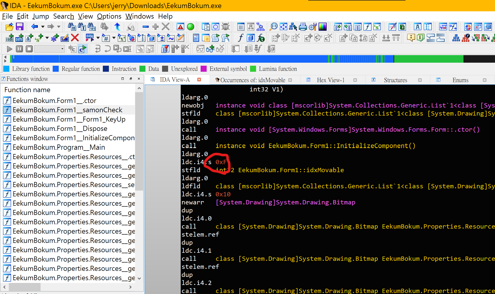
Change its value and patch it to new exe.
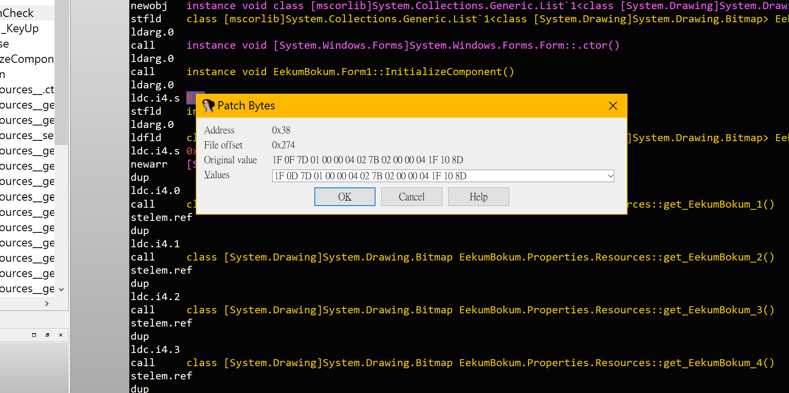
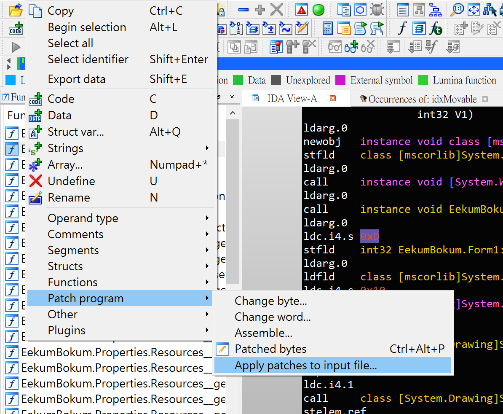
Restart the patched exe and you will get the flag.
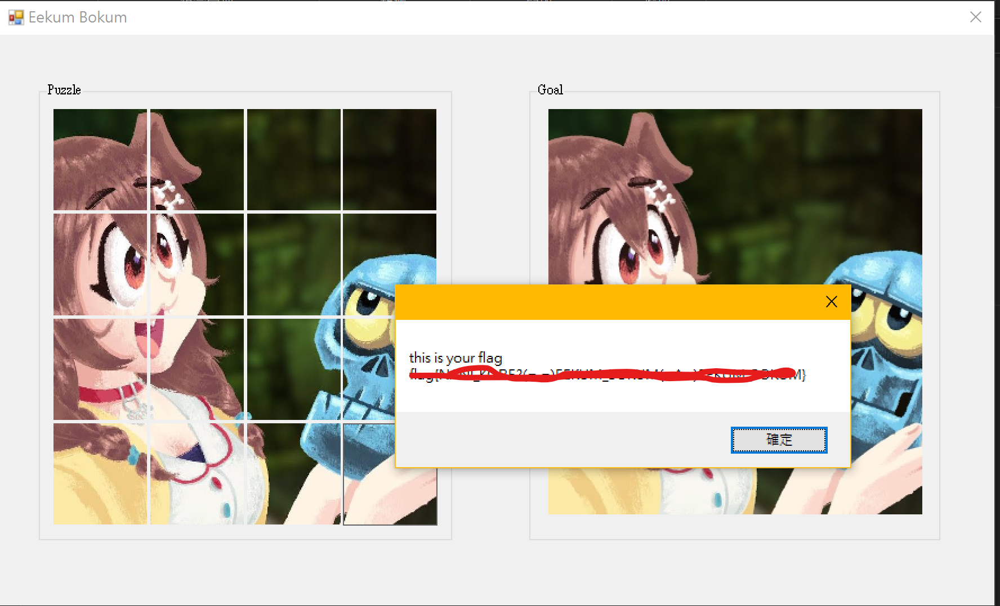

### Sol 2
Use **dnSpy32** to open it, and you will get all source codes...
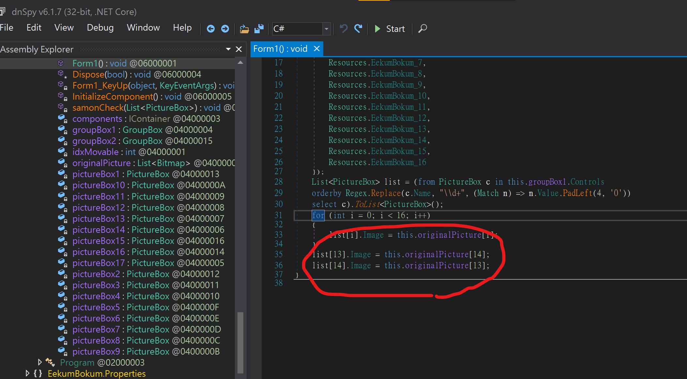
Comment the code which switchs two image in "form" class
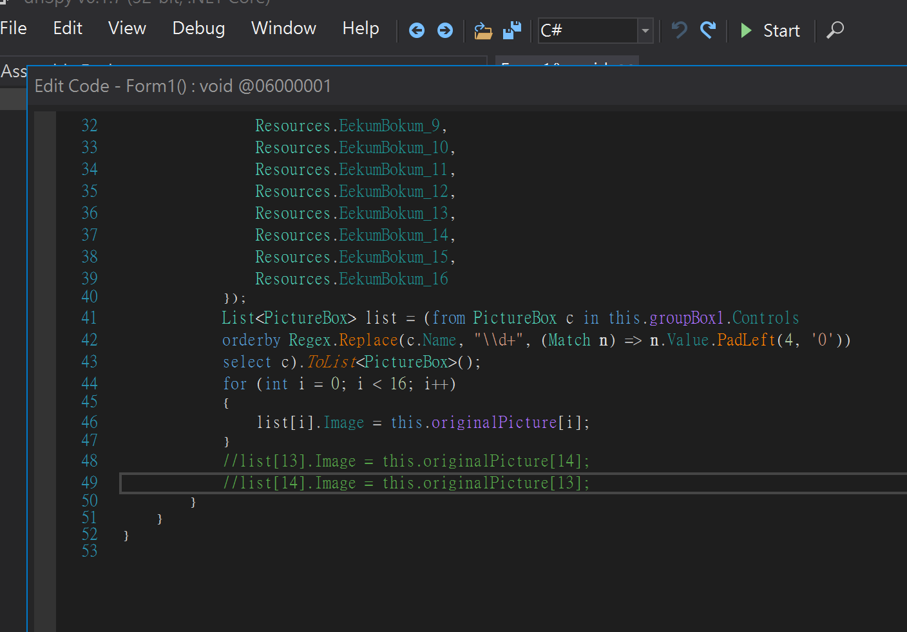
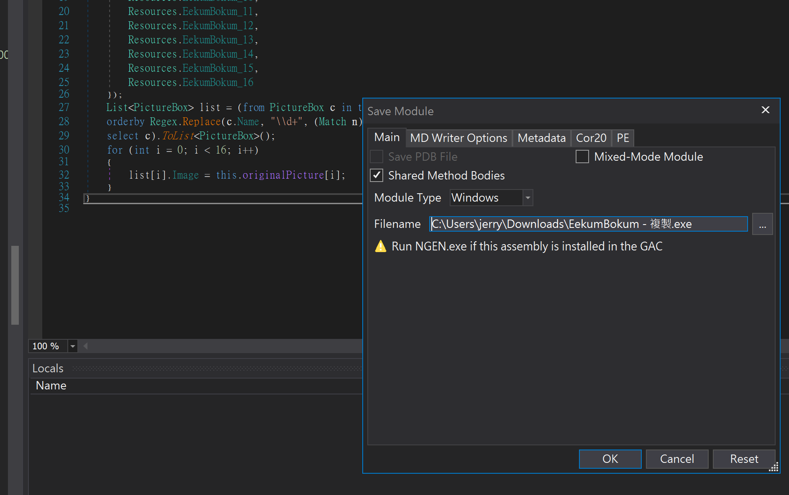

### Sol 3
Use **Cheat Engine** to analyze code run dynamically.
Find the address **which is controlling the puzzle**.
Change its value and you will get the flag.