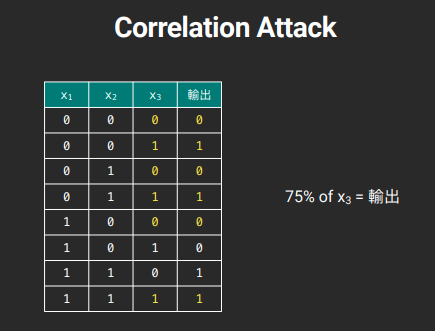
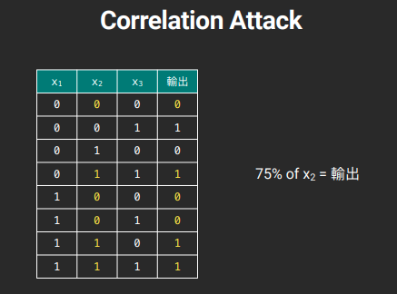

# Hw01

## COR (Correlation Attack)

### What is COR?
If we use Mixed LFSR to generate bits, and the operation of bits likes this:<br>
```python
class MyLFSR:
    ...
    def getbit(self):
        x1 = self.LFSR1.getbit()
        x2 = self.LFSR2.getbit()
        x3 = self.LFSR3.getbit()

        return (x1 & x2) ^ ((not x1) & x3)
    ...
```
The result of Mixed LFSR will be predictable because x2 and x3 have high degrees of similarity with result.<br><br>
For example: (Images are referred from the handout of TA oalieno)


<br><br>
By calculation, the probability of degree of similarity between **x2 and output** is about **75%**, and it is about **75%** same when between **x3 and output**.

### Attack
Following is my payload:<br>
```python
#!/usr/bin/env python3
from functools import reduce
import json
import string

class LFSR:
    def __init__(self, init, feedback):
        self.state = init
        self.feedback = feedback
    def getbit(self):
        nextbit = reduce(lambda x, y: x ^ y, [i & j for i, j in zip(self.state, self.feedback)])
        self.state = self.state[1:] + [nextbit]
        return nextbit

class MYLFSR:
    def __init__(self, inits):
        inits = [[int(i) for i in f"{int.from_bytes(init, 'big'):016b}"] for init in inits]
        self.l1 = LFSR(inits[0], [int(i) for i in f'{39989:016b}'])
        self.l2 = LFSR(inits[1], [int(i) for i in f'{40111:016b}'])
        self.l3 = LFSR(inits[2], [int(i) for i in f'{52453:016b}'])
    def getbit(self):
        x1 = self.l1.getbit()
        x2 = self.l2.getbit()
        x3 = self.l3.getbit()
        return (x1 & x2) ^ ((not x1) & x3)
    def getbyte(self):
        b = 0
        for i in range(8):
            b = (b << 1) + self.getbit()
        return bytes([b])

def bytes_to_bits(a):
    return [[int(i) for i in f"{int.from_bytes(init, 'big'):016b}"] for init in [a]]

def corr(a: list, b: list):
    assert len(a) == len(b)
    s = 0
    for i,j in zip(a,b):
        if i == j:
            s += 1
    return s/len(a)

l1_fb = [int(i) for i in f'{39989:016b}']
l2_fb = [int(i) for i in f'{40111:016b}']
l3_fb = [int(i) for i in f'{52453:016b}']

mx = 0
qq = string.printable.encode('utf-8')
FLAG = b''
# l3_fb
for i in qq:
    for j in qq:
        l = LFSR(bytes_to_bits(bytes([i]+[j]))[0], l3_fb)
        guess = [l.getbit() for _ in range(100)]
   
        tmp = corr(output, guess)
        if mx < tmp:
            print(f"score: {tmp}, val: {i}, {j}, payload: \"{bytes([i]+[j])}\"")
            mx = tmp
            ans = bytes([i] + [j])
FLAG = ans + FLAG
print(FLAG)

mx = 0
# l2_fb
for i in qq:
    for j in qq:
        l = LFSR(bytes_to_bits(bytes([i]+[j]))[0], l2_fb)
        guess = [l.getbit() for _ in range(100)]
   
        tmp = corr(output, guess)
        if mx < tmp:
            print(f"score: {tmp}, val: {i}, {j}, payload: \"{bytes([i]+[j])}\"")
            mx = tmp
            ans = bytes([i] + [j])
FLAG = ans + FLAG
print(FLAG)

mx = 0
FLAG = b'  ' + FLAG
# l1_fb
for i in qq:
    for j in qq:
        l = MYLFSR([bytes([i]+[j]), FLAG[2:4], FLAG[4:6]])
        guess = [l.getbit() for _ in range(100)]
   
        tmp = corr(output, guess)
        if mx < tmp:
            print(f"score: {tmp}, val: {i}, {j}, payload: \"{bytes([i]+[j])}\"")
            mx = tmp
            ans = bytes([i] + [j])
FLAG = ans + FLAG.re
```
<br><br>
Because the feedbacks of x1, x2 and x3 are known, we can easily generate x1, x2 and x3 by given any two bytes as initial value.<br>
So we can only use 256*256 times (2 bytes) to brute force the flag, and because flag is printable and not be `\n`, `\t`, `<space>`, `\r` and `\b`, we can reduce the range of character to 95, using 95*95 times to brute force each block.<br><br>

#### For flag[4:6]
When there is 2 bytes making the probability of degree of similarity between x3 and `output.txt` be larger than other 2 bytes (closing 75%), the 2 bytes propably are part of flag.

#### For flag[2:4]
Same as x3.

#### For flag[0:2]
Once we get `flag[2:6]`, all we need to do is brute force 2 bytes, trying to make the probability of degree of similarity between output of **our `MYLFSR` is 100% same as `output.txt`, then we will get the all flag.**